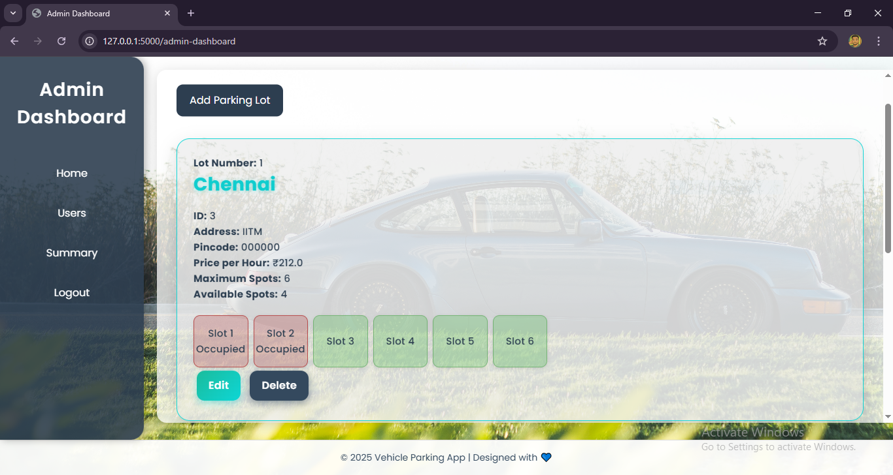

Car Parking Management System
A web-based application built with Python Flask for managing car parking operations. This system allows users to register, book, and manage parking slots, while administrators can oversee parking lots, view bookings, and analyze system performance through summaries and charts. Designed as a student project, it demonstrates full-stack development with a focus on user experience and database management.
Features

User Functionality:

Register and log in securely.
Search and book available parking slots by location or pincode.
View and manage active and past bookings.
Update personal profile details (name, email, address, pincode).
View booking history and unbook slots with cost calculations.
Access a user summary with booking trends and statistics.


Admin Functionality:

Log in to a dedicated admin dashboard.
Add, edit, or delete parking lots (with validation to prevent deletion of lots with active bookings).
Manage parking slot statuses (available/booked).
View detailed booking information, including user details and vehicle numbers.
Access system-wide summaries, including total revenue, user count, and booking trends.
Visualize booking data with monthly trend charts (requires Matplotlib).


System Features:

SQLite database with tables for users, admins, parking lots, slots, and bookings.
Automatic database initialization and schema migrations (e.g., adding columns like location_name and total_cost).
Real-time slot availability tracking.
Cost calculation based on booking duration and per-hour pricing.
Responsive UI built with Bootstrap for accessibility on various devices.


Technologies Used

Backend: Python, Flask
Database: SQLite3
Frontend: HTML, CSS, Bootstrap, Jinja2 templates
Optional: Matplotlib (for generating booking trend charts)
Other: Logging for error tracking, SQLite database migrations

How to Run the Project Locally
Follow these steps to set up and run the Car Parking Management System on your local machine.
Prerequisites

Python 3.8 or higher
pip (Python package manager)
Git (for cloning the repository)
Optional: Matplotlib (for chart generation)

Setup Instructions

Clone the Repository:
git clone https://github.com/Sdjishan552/Car-Parking-System.git
cd car-parking-management-system


Create a Virtual Environment:
python -m venv venv
source venv/bin/activate  # On Windows: venv\Scripts\activate


Install Dependencies:
pip install flask sqlite3

Optional: For chart generation, install Matplotlib:
pip install matplotlib


Initialize the Database:The database (parking_app.db) is automatically created and initialized when the application runs for the first time, thanks to the init_db() function in database.py. No manual setup is required.

Run the Application:
python app.py

The app will start in debug mode on http://127.0.0.1:5000.

Access the Application:

Open your browser and navigate to http://127.0.0.1:5000.
Default admin credentials: Username: admin, Password: admin123.
Register a new user via the "New User Registration" page to explore user features.


Notes

Ensure the static/charts directory is writable if using Matplotlib for chart generation.
The application uses Indian Standard Time (IST) for booking timestamps, adjusted by +5 hours and 30 minutes.

Folder Structure
```
car-parking-management-system/
│
├── app.py                  # Main Flask application
├── database.py             # Database initialization and operations
├── parking_app.db          # SQLite database file (auto-generated)
├── templates/              # HTML templates using Jinja2
│   ├── login.html
│   ├── admin-dashboard.html
│   ├── user-booking.html
│   ├── user-summery.html
│   ├── admin-summery.html
│   ├── new-parking-lot.html
│   ├── edit-lot.html
│   ├── delete-confirmation.html
│   ├── booking-detail.html
│   ├── booking-not-found.html
│   └── ... (other templates)
├── static/                 # Static assets (CSS, JS, images)
│   ├── css/                # Custom CSS and Bootstrap
│   ├── charts/
|   ├── img_1/
|   ├── image_2/                # Images
│   └── .../             # Generated charts (if Matplotlib is used)
├── screenshots/            # Screenshots for documentation
│   ├── Log-in_Page.PNG
│   ├── Admin-Dashboard.PNG
│   ├── User-Dashboard.PNG
├── LICENSE/
└── README.md               # Project documentation

```
Screenshots
Here are some key views of the Car Parking Management System:

Login Page: The entry point for users and admins, with options for login, registration, and admin access. 


Admin Dashboard: Displays parking lot details, slot statuses, and options to edit or delete lots.


User Booking: Allows users to search and book available parking slots at a selected location.


License
This project is licensed under the MIT License. See the LICENSE file for details.

Author
This project was developed by Syed Jishan Nawaz, a student passionate about web development and database-driven applications. As part of my learning journey, this project showcases my skills in full-stack development using Python and Flask.

GitHub: https://github.com/Sdjishan552
Email: sdjishan52@gmail.com

Feel free to reach out with feedback or questions!
